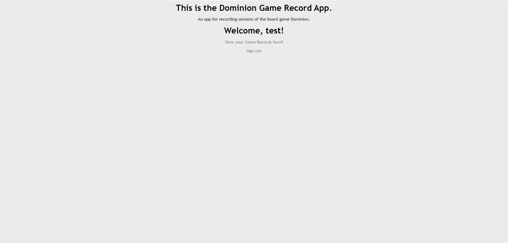
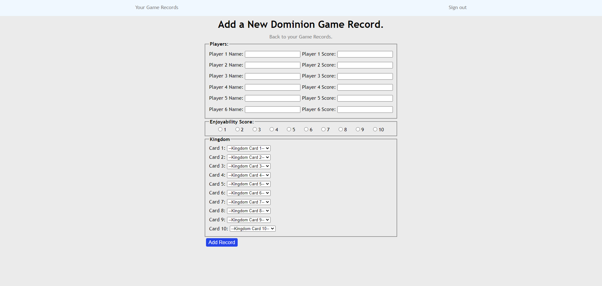
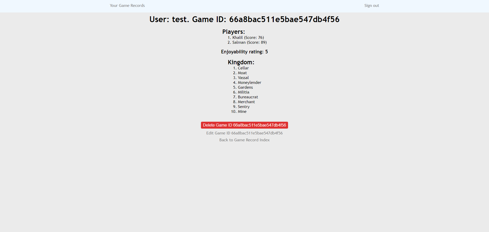

# Dominion Game Record
An app that records completed games of the board game [Dominion](https://en.wikipedia.org/wiki/Dominion_(card_game)). 

Every time you play this game, you randomly select a set of 10 cards to make up your Kingdom; meaning every game of Dominion will be different. This app allows you to record past games to go back to and replay previous Kingdoms that you enjoyed!

# Getting Started
[Start recording your games here!](https://dominion-game-record-8d346c4dc6f4.herokuapp.com/)

Currently only contains cards from the Base game of Dominion.

Plan:
[Trello](https://trello.com/b/dACeDD8w/dominion-game-record-project)

# Screenshots

# Technologies Used
This app was coded using MEN Stack (MongoDB, Express, Node.js).

# Next Steps
* Adding cards from Dominion expansions.
* Adding card images to display on records.
* Functionality to view other users' records, and to link users to players within each game.